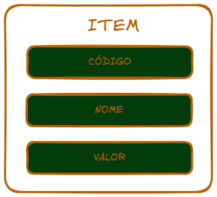

# LISTA LINEAR ESTÁTICA

##

## Itens
Para dar exemplo do funcionamento das listas criadas, para estrutura lista utilizaremos o elemento item. As listas armazenaram este elemento, como se fossem uma lista de itens de estoque de um supermercado. 

</img>

__Item__ : É uma estrutura que possuem três campos. 

>`Código`: um campo do tipo inteiro indo de 0000 até 9999, ou seja, cabem 10.000 itens diferente neste estoque. 

>`Nome`: campo de 150 caracteres para armazenar os nomes dos produtos.

>`Valor`: valor de ponto flutuante com duas casas decimais após o ponto que representa o valor do unitário do item.

  

## Documentação de Item

### Criando e Destruindo um Item

#### item_criar()
Aloca memória para um tipo _Item_ e retorna uma referencia do mesmo.

|Dados         |Tipo       |Descrição    |
|:------------ |:----------|:------------|
|`Parâmetro`   |**`void`** |Sem parametro|
|`Retorno`     |**`*Item`**|Referência do item alocado|

#### item_excluir(item)
Desaloca a memória alocada para um _Item_ passado como parâmetro.

|Dados         |Tipo       |Descrição    |
|:------------ |:----------|:------------|
|`Parâmetro`   |**`*Item`**|Referência do item alocado|
|`Retorno`     |**`void`**|Sem retorno|

### Operações de Inserção de Informação

#### item_inserir_codigo(item, codigo)
Insere um novo codigo a um item existente.
|Dados         |Tipo       |Descrição    |
|:------------ |:----------|:------------|
|`Parâmetro`   |**`*Item`**|Referência do item alocado|
|              |**`int`**  |Novo código do item|
|`Retorno`     |**`int`**|Retorna 0 para erro e 1 para sucesso|

#### item_inserir_nome(item, nome)
Insere um novo nome a um item existente.
|Dados         |Tipo       |Descrição    |
|:------------ |:----------|:------------|
|`Parâmetro`   |**`*Item`**|Referência do item alocado|
|              |**`char`**  |Vetor de 150 caracteres|
|`Retorno`     |**`int`**|Retorna 0 para erro e 1 para sucesso|

#### item_inserir_valor(item, valor)
Insere um novo valor a um item existente.
|Dados         |Tipo       |Descrição    |
|:------------ |:----------|:------------|
|`Parâmetro`   |**`*Item`**|Referência do item alocado|
|              |**`float`**  |Valor do novo código|
|`Retorno`     |**`int`**|Retorna 0 para erro e 1 para sucesso|

#### item_inserir_dados(item, codigo, nome, valor)
Insere codigo, nome e valor a um item existente.
|Dados         |Tipo       |Descrição    |
|:------------ |:----------|:------------|
|`Parâmetro`   |**`*Item`**|Referência do item alocado|
|              |**`int`**  |Valor do novo código|
|              |**`char`**  |Vetor de 150 caracteres|
|              |**`float`**  |Valor do novo código|
|`Retorno`     |**`int`**|Retorna 0 para erro e 1 para sucesso|

### Operações para pegar dados

#### item_pegar_codigo(item)
Pega o codigo de um item passado.
|Dados         |Tipo       |Descrição    |
|:------------ |:----------|:------------|
|`Parâmetro`   |**`*Item`**|Referência do item alocado|
|`Retorno`     |**`int`**|Codigo do item referenciado|

#### item_pegar_nome(item)
Pega o nome de um item passado.
|Dados         |Tipo       |Descrição    |
|:------------ |:----------|:------------|
|`Parâmetro`   |**`*Item`**|Referência do item alocado|
|`Retorno`     |**`char`**|Nome do item referenciado|

#### item_pegar_valor(item)
Pega o valor de um item passado.
|Dados         |Tipo       |Descrição    |
|:------------ |:----------|:------------|
|`Parâmetro`   |**`*Item`**|Referência do item alocado|
|`Retorno`     |**`float`**|Valor do item referênciado|

#### item_pegar_dados(item, codigo, nome, valor)
Paga o codigo, nome e valor de um item passado.
|Dados         |Tipo       |Descrição    |
|:------------ |:----------|:------------|
|`Parâmetro`   |**`*Item`**|Referência do item alocado|
|              |**`int`**|Onde codigo do item deve ser copiado|
|              |**`char`**|Onde nome do item deve ser copiado|
|              |**`float`**|Onde valor do item deve ser copiado|
|`Retorno`     |**`int`**|Retorna 0 para erro e 1 para sucesso|

### Exibindo resultados

#### item_exibir_dados(item)
Exibe as informações de um item passado.
|Dados         |Tipo       |Descrição    |
|:------------ |:----------|:------------|
|`Parâmetro`   |**`*Item`**|Referência do item alocado|
|`Retorno`     |**`void`**|Sem retorno|
